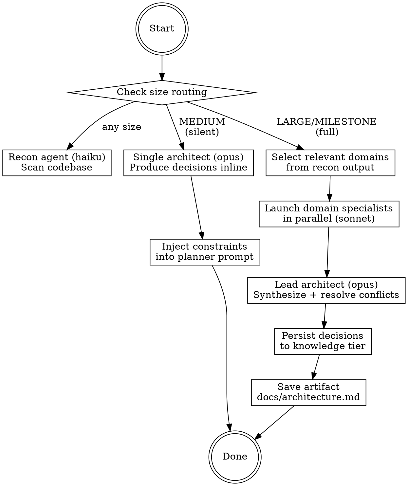

# Engineering Architect

Analyze the codebase and spec to produce architectural decision records that constrain downstream planning and implementation.

## Two Modes

**Silent mode** (MEDIUM — invoked automatically inside `/pipeline:plan`):
- Recon (haiku) scans codebase → single architect pass (opus) produces decision records inline
- Constraints injected directly into planner prompt — no separate artifact
- 2 agent calls total. Invisible to the builder.

**Full mode** (LARGE/MILESTONE — invoked via `/pipeline:architect` or auto-invoked by plan):
- Recon (haiku) → parallel domain specialists (sonnet) → lead architect synthesis (opus)
- Produces decision records artifact, persists to knowledge tier
- Only relevant domains dispatched (recon determines which).

## Recon Anchor Contract

Every claim in a recon Constraints Block must cite an anchor recognized by
`scripts/pipeline-lint-recon.js` — `[File: path]`, `[Function: name]`, `[Field: name]`,
`[Pattern: name]`, `[Library: name]`, or `[Version: x.y.z]`. See `recon-agent-prompt.md`
in this skill directory for the full anchor format and per-section requirements. The lint
is a hard gate: recon output that fails lint blocks downstream planning. The orchestrator
runs the linter after every recon dispatch and re-dispatches with findings as feedback
(up to 3 iterations) before escalating to the user.

## Process Flow



Note: Both paths start with recon. The fork is after recon completes.

## Silent Mode (MEDIUM)

### Step 1 — Recon

Dispatch the recon agent using `recon-agent-prompt.md` from this skill directory.

Substitutions:
- `{{MODEL}}` → `models.cheap` from pipeline.yml
- `[SOURCE_DIRS]` → `routing.source_dirs` from pipeline.yml
- `[SPEC_SUMMARY]` → 3-5 sentence summary from the spec being planned
- `[KNOWLEDGE_CONTEXT]` → past decisions from knowledge tier (postgres query or DECISIONS.md)
- `[PROJECT_PROFILE]` → `project.profile` from pipeline.yml

The recon agent returns a **Constraints Block** with: existing stack, established patterns, relevant domains, test coverage, environment requirements.

### Step 1b — Lint recon output

Save the recon agent's output to a temp file, then run the structural linter against it:

```bash
RECON_FILE="${TMPDIR:-/tmp}/recon-output-${SESSION_ID:-$$}.md"
# (write recon agent output to $RECON_FILE)
node scripts/pipeline-lint-recon.js --recon "$RECON_FILE"
```

If the linter exits non-zero, re-dispatch the recon agent with the lint findings appended
as a `## Lint Feedback` section in the prompt. Repeat up to **3 iterations total**.
After iteration 3, halt and escalate to the user — do not proceed to Step 2.

### Step 2 — Single Architect Pass

Do NOT dispatch a subagent for silent mode. The orchestrator (plan command) reads the recon output and uses it directly as context when generating the implementation plan.

Inject the Constraints Block into the planner's prompt as an `## Architectural Constraints` section. The planner must:
- Follow established patterns (don't introduce a new state library when one exists)
- Respect existing conventions (naming, file organization, export style)
- Note any deviations required by the spec as explicit decision records in the plan

If the spec requires decisions in areas the codebase hasn't addressed yet (e.g., first database usage), the planner should make a lightweight decision and document it as a decision record in the plan header.

### Output (silent mode)

No separate artifact. Constraints are embedded in the implementation plan as:

```markdown
## Architectural Constraints (from recon)

### Existing Stack
[from recon output]

### Established Patterns
[from recon output]

### Decisions for This Feature
- DECISION-001: [title] — [decision]. Invalidate if: [condition].
- DECISION-002: [title] — [decision]. Invalidate if: [condition].
```

## Full Mode (LARGE/MILESTONE)

### Step 1 — Recon

Same as silent mode. Dispatch recon agent, get Constraints Block.

### Step 1b — Lint recon output

Same as silent mode Step 1b. Save output to temp file, run
`node scripts/pipeline-lint-recon.js --recon <path>`, re-dispatch with findings on
failure. Maximum **3 iterations**. Escalate to user on iteration 3 failure.

### Step 2 — Select Relevant Domains

Read the "Relevant Domains" section from the recon output. Cross-reference with `architect.skip[]` from pipeline.yml — remove any skipped domains.

**Dynamic selection is critical.** Do NOT dispatch all six domains. Only dispatch domains the recon agent identified as relevant. A CLI tool might get 2-3 domains. A fullstack app might get 5-6. The recon agent's assessment drives this, not a static profile table.

If recon identifies 0-1 relevant domains, fall back to silent mode (single architect pass). The full orchestration is only justified when multiple domains need coordinated decisions.

### Step 3 — Dispatch Domain Specialists

For each relevant domain, dispatch a specialist using `specialist-agent-prompt.md`.

Launch ALL relevant specialists in parallel (same pattern as red team).

Substitutions per specialist:
- `{{MODEL}}` → `models.review` from pipeline.yml (e.g., `sonnet`)
- `[DOMAIN_ID]` → domain ID (e.g., `DATA`, `STATE`, `UI`)
- `[DOMAIN_NAME]` → full domain name (e.g., `Data Layer`, `State Management`)
- `[DOMAIN_CHECKLIST]` → checklist from `domain-definitions.md` for this domain
- `[RECON_CONSTRAINTS]` → full Constraints Block from recon output
- `[SPEC_SUMMARY]` → same spec summary used for recon
- `[KNOWLEDGE_CONTEXT]` → past decisions from knowledge tier
- `[NON_NEGOTIABLE]` → `review.non_negotiable[]` from pipeline.yml
- `[SOURCE_DIRS]` → `routing.source_dirs` from pipeline.yml

Each specialist returns structured decisions:
```
DECISION [DOMAIN_ID]-[NNN] | [CONFIDENCE] | [title]
[Decision text]
[Rationale and trade-offs]
[Constraints for implementers]
[Invalidate if: condition]
[Big 4 impact]
```

### Step 4 — Lead Architect Synthesis

Dispatch the lead architect using `lead-architect-prompt.md`.

The lead architect receives ALL specialist outputs and MUST:
1. Identify conflicts between domain recommendations (e.g., DATA wants event sourcing, STATE wants normalized cache)
2. Resolve conflicts into a coherent set of decisions
3. Check cross-domain dependency chain: DATA → STATE → UI, API → DATA+STATE, INFRA → all, TEST → all
4. Produce the final decision records
5. Flag any decisions with LOW confidence for builder review

### Step 5 — Persist to Knowledge Tier

**Postgres tier:**
```bash
PROJECT_ROOT=$(pwd) node [scripts_dir]/pipeline-db.js update decision "$(cat <<'TOPIC'
arch-[feature]-[domain]
TOPIC
)" "$(cat <<'SUMMARY'
[date]: [decision title]
SUMMARY
)" "$(cat <<'DETAIL'
[decision text + rationale]
DETAIL
)"
```

**Files tier:** Only persist locked decisions to DECISIONS.md.

### Step 6 — Save Artifact

Save to `docs/architecture.md` at the project root. This is a persistent, evolving document —
not per-feature. If it already exists, merge using the algorithm defined in the architect command.

````markdown
# Architecture — [Project Name]

**Last updated:** [date] | **Profile:** [profile] | **Domains analyzed:** [list]

## Project Structure

[Directory layout with purpose annotations. Generated from recon output.]

    src/
      app/          — Next.js App Router pages and layouts
      components/   — Shared React components
      lib/          — Business logic and utilities
      ...

## Code Patterns

[Established patterns from the codebase. Each pattern is a concrete rule.]

- **Component style:** [e.g., "Server components by default; 'use client' only for interactivity"]
- **Data fetching:** [e.g., "No raw fetch(); all data through useQuery hooks"]
- **Error handling:** [e.g., "Error boundaries at route level; try/catch in server actions"]
- **State management:** [e.g., "URL state for filters; React context for auth; no global store"]

## Typed Contracts

[Function signatures, API shapes, and data models concrete enough to generate stubs.
 These enable parallel development — one team can code against the contract before
 the implementation exists.]

### API Endpoints

| Method | Path | Request | Response | Auth |
|--------|------|---------|----------|------|
| POST | /api/example | `{ field: string }` | `{ id: string, created: Date }` | required |

### Key Interfaces

```typescript
// [interface name] — [purpose]
interface Example {
  id: string;
  // ...
}
```

## Decisions

### DECISION-[NNN]: [Title]
- **Domain:** [DATA/STATE/UI/API/INFRA/TEST]
- **Decision:** [specific choice]
- **Rationale:** [why, trade-offs considered]
- **Confidence:** HIGH/MEDIUM/LOW
- **Constraints for implementers:**
  - [concrete rule]
- **Invalidate if:** [condition]

[repeat for each decision]

## Security Standards

- [e.g., "All user input validated with Zod at API boundary"]
- [e.g., "No secrets in client bundles; server-only via 'server-only' package"]
- [e.g., "CSRF protection via SameSite cookies + origin check"]
- [e.g., "SQL injection prevention: parameterized queries only, no string interpolation"]

## Testing Standards

- [e.g., "Unit tests required for business logic; optional for UI components"]
- [e.g., "Integration tests at API boundary; e2e for critical user flows"]
- [e.g., "Test file co-located: `foo.test.ts` next to `foo.ts`"]

## Banned Patterns

[Patterns that MUST NOT appear in the codebase. Build agents and reviewers check against this.]

| Pattern | Why Banned | Use Instead |
|---------|-----------|-------------|
| `any` type | Defeats type safety | Explicit types or `unknown` |
| `document.cookie` | XSS vector | Server-only session management |

## Constraints Summary

[Flat bulleted list of ALL implementer constraints from all sections above —
 this is what the planner and build agents consume directly.]

## Override Instructions

To override a decision, add an OVERRIDE annotation:

    DECISION-003: Use Prisma ORM
    OVERRIDE: Using Drizzle — target is Cloudflare Workers, Prisma unsupported.

Overrides propagate as hard constraints to all downstream agents.
````

### Step 7 — Present to Builder

Show the builder a summary of decisions. Flag any LOW confidence decisions for their review.

If the builder overrides any decision, apply the override and update the artifact.

## Decision Record Lifecycle

Decision records are individually addressable and invalidatable:

1. **Created** during architect step (silent or full mode)
2. **Consumed** by planner (as constraints), build agents (as `{{ARCHITECTURAL_CONSTRAINTS}}`), and reviewer (as compliance checks)
3. **Invalidated** when a build agent encounters a real-world constraint that contradicts the decision — agent reports `DONE_WITH_CONCERNS` with the specific conflict
4. **Overridden** when the builder explicitly corrects a decision
5. **Re-evaluated** — only the invalidated decision and its dependents need re-evaluation, not the whole set

This is NOT a monolithic roadmap. Each decision stands alone with its own invalidation condition.

## Anti-Rationalization

| Thought | Reality |
|---------|---------|
| "Let's just use the latest framework" | Check what the codebase already uses. Consistency > novelty. |
| "We need all six domains" | Recon determines relevance. Most projects need 2-4. |
| "This decision is obvious" | Document it anyway. What's obvious to you is context for the build agent. |
| "The conflicts don't matter" | Cross-domain conflicts become implementation bugs. Resolve them now. |
| "Silent mode is fine for this LARGE change" | If recon found 3+ relevant domains, use full mode. |
| "I'll add anchors later" | No. Recon output is gated by `pipeline-lint-recon.js`. Unanchored claims cannot pass the gate. |
| "The pattern is obviously named-export" | Cite `[File: path]` showing it. The lint allowlist is intentionally narrow — assertion without evidence is rejected. |

## Issue Tracker Contract

Architecture spans **Category 2 (Issue-Creating)** and **Category 3 (Decision Command)** per `skills/github-tracking/SKILL.md`. Category 3 governs the summary comment; Category 2 governs child issue creation for LOW-confidence decisions.

When `integrations.github.enabled` and `integrations.github.issue_tracking` are both `true`:

1. Read `github_epic: N` from the plan or spec metadata
2. Post a summary comment on the epic after completing the decision records (Category 3)
3. For each LOW-confidence decision, create a child issue with label `pipeline:decision` (Category 2). HIGH/MEDIUM decisions do not get child issues.

**Comment format:**

```
## Architecture

**Decisions produced:** [N]
**Domains analyzed:** [list]
**LOW confidence decisions:** [count, or "None"]
[1-sentence posture summary]

Artifact: `docs/architecture.md`
```

If the epic is not found, skip tracking silently. Do not fail the architect run.
