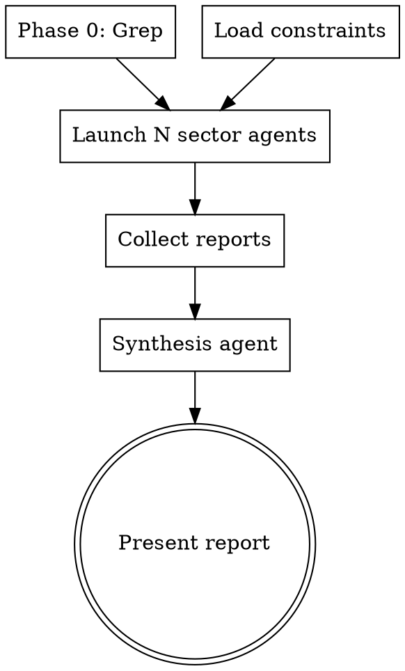

# Full Codebase Audit

## Overview

Comprehensive codebase review using parallel sector agents. Each sector reviews a slice of the
codebase independently, then a synthesis agent performs cross-sector analysis.

**Core principle:** Parallel review for speed, synthesis for cross-cutting issues.

## The Process



## Phase 0: Grep Preprocessing

Run all patterns from `review.phase0_patterns[]` in parallel before spawning agents.
This identifies hot-spots so agents read surgically rather than blindly.

Default patterns (configurable):
- Unguarded awaits
- Forced non-null assertions
- console.log in production code
- fetch() calls (check for AbortController)
- Framework-specific patterns (detected from deps)

Filter results by sector and include relevant hits in each agent's prompt.

## Sector Definitions

Sectors come from `review.sectors[]` in pipeline.yml. If none configured, auto-split
by top-level directories under `routing.source_dirs`.

Each sector defines:
- `name` — human-readable name
- `id` — short ID for finding prefixes (A, B, C...)
- `paths` — glob patterns for files in this sector

## Two-Pass Read Protocol

Agents follow this to minimize tokens:

**Pass 1 — Grep and enumerate:**
- Review Phase 0 hits
- Read first ~40 lines of each file (imports + declarations)
- List files needing full read

**Pass 2 — Targeted reads:**
- Full body of every symbol with a Phase 0 hit
- Render/return blocks of page components
- Skip files where Pass 1 finds no hits and imports are clean

## Structured Output Format

Every finding uses:
```
FINDING [SECTOR]-[NNN] | [🔴/🟡/🔵] | [file:line] | [category]
[Description of problem and consequence]
```

## Cross-Reference Manifest

Each sector agent appends:
- Symbols called from outside the sector
- Symbols defined that other sectors call
- Framework-specific keys used (i18n, localStorage, etc.)
- Potential dead exports
- Cross-sector code paths
- SOLID concerns

## Synthesis Agent

The synthesis agent receives all sector reports and performs:
1. Cross-sector crash path tracing
2. Dead export verification (grep to confirm)
3. Cross-sector duplication detection
4. Severity escalation (sector A suspicious + sector B confirms = 🔴)
5. Deduplication (keep most specific version)
6. Simplify candidate collection

## Post-Fix Protocol

After fixing findings from this review:
1. Run test suite — if green, verification complete
2. Do NOT re-run /pipeline:audit after fixes (~150K+ tokens)
3. Only run targeted single-file review if a fix introduced significant new complexity

## Key Principles

- **Read-only** — never modify code during audit
- **Config-driven** — sectors, patterns, criteria all from pipeline.yml
- **Parallel** — all sector agents run simultaneously
- **Evidence-based** — Phase 0 grep before reading, targeted reads only
- **Structured** — machine-parseable finding format for post-processing
