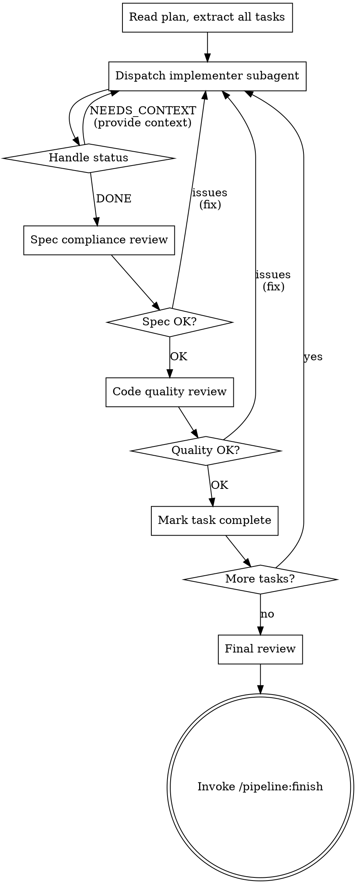

# Subagent-Driven Development

Execute plan by dispatching fresh subagent per task, with two-stage review:
spec compliance review first, then code quality review.

**Core principle:** Fresh subagent per task + two-stage review = high quality, fast iteration.

## When to Use

- Have an implementation plan with defined tasks
- Tasks are mostly independent
- Want automated review between tasks

## The Process

## Model Selection

Use the least powerful model that can handle each role:

- **Mechanical tasks** (1-2 files, clear spec): use config `models.explore` (haiku)
- **Integration tasks** (multi-file, pattern matching): use config `models.implement` (sonnet)
- **Review tasks**: use config `models.review` (sonnet)

Task complexity signals:
- Touches 1-2 files with complete spec → cheap model
- Touches multiple files with integration concerns → standard model
- Requires design judgment → most capable model

## Handling Implementer Status

**DONE:** Proceed to spec compliance review.

**DONE_WITH_CONCERNS:** Read concerns. Address correctness/scope issues before review.
Note observations and proceed.

**NEEDS_CONTEXT:** Provide missing context and re-dispatch.

**BLOCKED:** Assess:
1. Context problem → provide more context, re-dispatch
2. Needs more reasoning → re-dispatch with more capable model
3. Task too large → break into smaller pieces
4. Plan wrong → escalate to user

**Never** ignore escalations or force retry without changes.

## Prompt Templates

- `./implementer-prompt.md` — Dispatch implementer subagent
- `./spec-reviewer-prompt.md` — Dispatch spec compliance reviewer
- `./quality-reviewer-prompt.md` — Dispatch code quality reviewer

## Red Flags

**Never:**
- Skip reviews (spec compliance OR code quality)
- Proceed with unfixed issues
- Dispatch multiple implementation subagents in parallel (conflicts)
- Make subagent read plan file (provide full text instead)
- Skip scene-setting context
- Accept "close enough" on spec compliance
- Start code quality review before spec compliance is approved
- Move to next task while review has open issues

**If subagent asks questions:** Answer clearly and completely before proceeding.

**If reviewer finds issues:** Implementer fixes → reviewer re-reviews → repeat until approved.

**If subagent fails:** Dispatch fix subagent with specific instructions. Don't fix manually.
