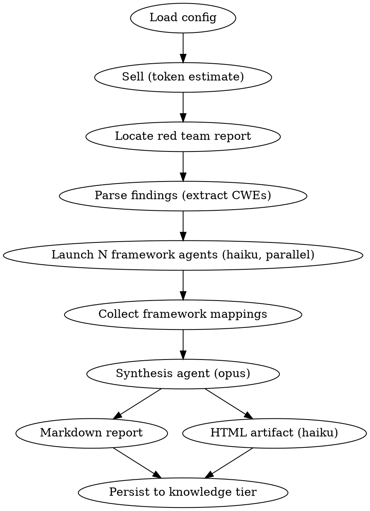

# Compliance Framework Mapping

## Overview

Maps red team findings (with CWE IDs) to regulatory compliance controls and produces a coverage scope analysis. This is compliance preparation — not a compliance assessment. The output helps teams understand which controls their security testing addresses and which require organizational or procedural assessment.

**Core principle:** Be accurate about what code analysis CAN tell you, and honest about what it CANNOT.

## The Process

## Framework Tiers

Frameworks are tiered by mapping quality — the tier determines how detailed and authoritative the mapping output is.

| Tier | Frameworks | Mapping Source | Output Detail |
|------|-----------|----------------|---------------|
| 1 | NIST 800-53, PCI DSS 4.0 | Official CWE crosswalks (MITRE/NIST, PCI SSC) | Full control-by-control mapping with CWE evidence chains |
| 2 | ISO 27001, NIST CSF 2.0 | Inference from control descriptions, 800-53 chaining | Control-by-control mapping with inference notes |
| 3 | SOC 2, GDPR, HIPAA | Limited to software-relevant subsets only | Relevant-findings view with prominent scope disclaimer |

## Output Vocabulary

Do NOT use TESTED/UNTESTED/PASS/FAIL. These imply compliance assertions Pipeline cannot make.

| Verdict | Meaning | When to Use |
|---------|---------|-------------|
| **MAPPED** | One or more red team findings directly map to this control via CWE | Direct CWE→control crosswalk match exists |
| **RELATED** | A finding addresses a related concern but not the exact control requirement | CWE addresses a subset of the control, or the mapping requires interpretive inference |
| **OUTSIDE_AUTOMATED_SCOPE** | This control requires organizational, procedural, or infrastructure assessment | The control addresses physical security, policy, training, organizational structure, or infrastructure configuration not visible in source code |

### Critical distinction

If a control IS software-testable but no red team finding maps to it, it is simply **not listed in the mapping index** — it is NOT marked OUTSIDE_AUTOMATED_SCOPE. The scope analysis section separately identifies which control families are within automated scope but have no mapped findings.

## Scope Analysis

Instead of gap analysis (which implies controls are "untested"), produce coverage scope analysis:

1. **Within automated scope, with mapped findings** — control families where red team findings provide direct CWE evidence
2. **Within automated scope, without mapped findings** — control families that code analysis CAN address but where no red team finding maps (this is the actionable insight — consider expanding red team specialist coverage)
3. **Outside automated scope** — control families that require organizational, procedural, or infrastructure assessment. Route these to your GRC team or compliance platform.

## Model Routing

| Task | Model Config Key | Typical Model |
|------|-----------------|---------------|
| Framework agents (per-framework mapping) | `models.cheap` | haiku |
| Synthesis agent (cross-framework analysis) | `models.architecture` | opus |
| HTML report | `models.cheap` | haiku |

## Prompt Template References

- `./framework-agent-prompt.md` — per-framework mapping agent
- `./synthesis-prompt.md` — cross-framework synthesis agent
- `./html-report-prompt.md` — HTML report generator
- `./control-mappings.md` — static CWE-to-control reference data

## Red Flags — Rationalization Prevention

| Thought | Reality |
|---------|---------|
| "This control is MAPPED because we tested something similar" | RELATED at best. Only use MAPPED for direct CWE→control crosswalk matches. |
| "Mark this OUTSIDE_AUTOMATED_SCOPE since we didn't find anything" | OUTSIDE_AUTOMATED_SCOPE means the control is procedural/organizational. If it's software-testable but has no finding, it's simply unmapped — note it in the scope analysis. |
| "The user probably doesn't need the disclaimer" | Every output. Every time. No exceptions. |
| "The coverage percentage looks low, let's be generous with RELATED" | Low coverage is honest. Inflated coverage is dangerous — it creates false confidence before audits. |
| "We can infer this SOC 2 criterion is met" | SOC 2 criteria are principle-based. Code analysis cannot determine if a principle is met. Map findings and stop. |
| "This GDPR article is satisfied by our encryption check" | GDPR articles have legal scope beyond technical measures. Flag the technical aspect and explicitly note the legal aspects are outside scope. |
