# Dashboard Generation

## Overview

Generates a self-contained HTML dashboard from current project state. Called by `/pipeline:dashboard` directly, and as a final step by state-changing commands. Zero outbound calls from the generated HTML — all data embedded at generation time.

## Process Flow

```dot
digraph dashboard {
  rankdir=LR;
  node [shape=box, style=rounded];

  config [label="Read\npipeline.yml"];
  phase [label="Derive\nPhase"];
  state [label="Collect\nState"];
  git [label="Collect\nGit State"];
  github [label="Issue Tracker\n(if enabled)"];
  haiku [label="Haiku\nRecommendations"];
  substitute [label="Substitute\nTemplate"];
  write [label="Atomic\nWrite"];

  readme [label="README\nRoadmap Sync\n(postgres only)"];

  config -> phase -> state -> git -> github -> haiku -> substitute -> write -> readme;
}
```



## Step 1 — Read Config

Read `.claude/pipeline.yml`. Extract:

- `project.name`, `project.repo`, `project.branch`
- `dashboard.enabled`, `dashboard.milestone`
- `knowledge.tier`
- `integrations.github.enabled`
- `integrations.github.issue_tracking`
- `integrations.postgres.enabled`
- `docs.specs_dir`, `docs.plans_dir`
- `models.cheap` (for haiku recommendations)

## Step 2 — Derive Phase

Check artifacts in order (first match wins):

| Check | Phase | Artifact Subtitle |
|---|---|---|
| Git tag exists after most recent plan file date | Released | Tag name |
| Findings files exist AND all remediated (remediation file covers all finding files) | Ready for Release | Latest remediation file |
| Findings files exist with unremediated items | Reviewing | Latest findings file |
| Commits exist after plan creation date | Building | Plan file name |
| Plan file exists in `docs.plans_dir` | Planned | Plan file name |
| Spec file exists in `docs.specs_dir` | Designed | Spec file name |
| None | Not Started | — |

**Phase check commands:**

**Note:** Ensure `docs.specs_dir` and `docs.plans_dir` values end with `/`. If the config value lacks a trailing slash, append one before substituting (e.g., `docs/specs` → `docs/specs/`).

```bash
# Check for specs (ensure trailing slash on dir path)
ls -t [docs.specs_dir]/*.md 2>/dev/null | head -1

# Check for plans (ensure trailing slash on dir path)
ls -t [docs.plans_dir]/*.md 2>/dev/null | head -1

# Check for findings (excluding remediation files)
ls docs/findings/*.md 2>/dev/null | grep -v 'remediation-' | grep -v 'triage-' | head -1

# Check for remediation
ls -t docs/findings/remediation-*.md 2>/dev/null | head -1

# Check for tags after plan date
git tag --sort=-creatordate | head -1
```

**Files-tier finding status:** Cross-reference `docs/findings/[source]-*.md` against `docs/findings/remediation-*.md`. If a remediation file exists and shows all findings as fixed/verified, those findings are closed.

## Step 3 — Collect State Data

**If Postgres tier:**

```bash
node scripts/pipeline-db.js query "SELECT status, COUNT(*) as cnt FROM tasks GROUP BY status"
node scripts/pipeline-db.js query "SELECT severity, COUNT(*) as cnt FROM findings WHERE status NOT IN ('fixed','verified','wontfix') GROUP BY severity"
node scripts/pipeline-db.js query "SELECT * FROM tasks WHERE status = 'in_progress' ORDER BY updated_at DESC LIMIT 5"
node scripts/pipeline-db.js query "SELECT * FROM tasks WHERE status = 'pending' ORDER BY id LIMIT 2"
node scripts/pipeline-db.js query "SELECT topic, decision, created_at FROM decisions ORDER BY created_at DESC LIMIT 5"
```

**If files tier:**

- Parse plan markdown for task count (count numbered list items or headings)
- Count finding files: `ls docs/findings/*.md 2>/dev/null | grep -v remediation | grep -v triage | wc -l`
- Parse finding file headers for severity counts
- Read DECISIONS.md for recent decisions

## Step 4 — Collect Git State

```bash
git log --oneline -10
git branch --show-current
git rev-parse --short HEAD
git log --oneline origin/[branch]..HEAD 2>/dev/null | wc -l  # unpushed commits
```

## Step 5 — Issue Tracker + Feature Epic (if enabled)

If `integrations.github.enabled` is false, set `{{GITHUB_EPIC}}` and `{{GITHUB_ISSUES}}` to empty-state HTML and skip to Step 6.

### Step 5a — Find active epic

If `integrations.github.issue_tracking` is true:

Read the most recent spec file from `docs.specs_dir` for a `github_epic: N` line in the YAML frontmatter.
If not found in spec, check the most recent plan file from `docs.plans_dir`.

If a `github_epic` number is found:

```bash
node '[SCRIPTS_DIR]/platform.js' issue view [N]
```

If the command fails, notify the user with the error and ask for guidance.

**Parse the issue body** for the status checklist (brainstorm creates this):
- `- [x] Brainstorm` → done
- `- [ ] Plan` → pending
- Extract each checkbox state for: Brainstorm, Plan, Build, QA, Review, Ship

**Parse comments** for activity entries (newest 10):
Each lifecycle command posts a comment with a heading (e.g., `## Plan Created`, `## Build Started`, `## QA Verdict`).
Extract heading + timestamp as activity items for the `{{ACTIVITY_FEED}}`.

If no `github_epic` found or `issue_tracking` is false: set EPIC_DATA to null.

### Step 5b — Fetch open issues

```bash
node '[SCRIPTS_DIR]/platform.js' issue search '' --state open --limit 20
```

If the command fails, notify the user with the error and ask for guidance.

If `issue_tracking` is true, group issues by label:
- `pipeline:qa` → QA Failures
- `review` → Review Findings
- `redteam` → Security Findings
- `pipeline:decision` → Decisions
- `pipeline:epic` → Epic (exclude from issue list, shown in epic card)
- (unlabeled or other) → Other

If `issue_tracking` is false: display as a flat list (backward compatible).

### Step 5c — Build substitution data

**EPIC_DATA** (null if no epic found):
- epic_number, epic_title, epic_state
- checklist: [{name: "Brainstorm", done: true}, {name: "Plan", done: true}, ...]
- linked_issue_count (count of open issues excluding the epic itself)

**ISSUE_GROUPS** (only when issue_tracking is true):
- { label: "pipeline:qa", display: "QA Failures", issues: [...] }
- { label: "review", display: "Review Findings", issues: [...] }
- { label: "redteam", display: "Security Findings", issues: [...] }
- { label: "pipeline:decision", display: "Decisions", issues: [...] }
- { label: "other", display: "Other", issues: [...] }

Only include groups that have at least one issue.

**EPIC_ACTIVITY**: Recent epic comments as activity items (## heading → activity line).
Merge these into the `{{ACTIVITY_FEED}}` alongside git commits.

**Empty states:**
- Issue tracking disabled: `<p class="section-empty">Issue tracking not enabled.</p>` for both tokens
- Issue tracking enabled, `issue_tracking: false`: `<p class="section-empty">Issue tracking disabled. Enable <code>issue_tracking</code> in pipeline.yml to track feature epics.</p>` for `{{GITHUB_EPIC}}`
- Issue tracking enabled, `issue_tracking: true`, no epic: `<p class="section-empty">No active feature epic. Run <code>/pipeline:brainstorm</code> to create one.</p>` for `{{GITHUB_EPIC}}`
- No open issues: `<p class="section-empty">No open issues.</p>` for `{{GITHUB_ISSUES}}`

## Step 5d — Workflow State (if Postgres tier)

If `knowledge.tier` is `"postgres"`, query the orchestrator's workflow state:

```bash
PROJECT_ROOT=$(pwd) node [scripts_dir]/pipeline-db.js query "SELECT step, status, result_code, fail_count, started_at, completed_at FROM workflow_state WHERE workflow_id = (SELECT DISTINCT workflow_id FROM workflow_state ORDER BY workflow_id DESC LIMIT 1) ORDER BY id"
```

If the query returns rows, build workflow state data for the `{{WORKFLOW_STATE}}` placeholder:

### External view (5-step, for entrepreneur/boss engagement style)

Collapse the 13 orchestrator steps into 5 user-facing phases:

| Phase | Orchestrator steps | Label |
|-------|-------------------|-------|
| Design | init, brainstorm, plan, debate, architect | Design |
| Build | build | Build |
| Review | review, qa | Review |
| Security | redteam, purple | Security |
| Ship | commit, finish, deploy | Ship |

Phase status: if ALL steps in the phase are `done` or `skipped` → complete. If ANY step is `running` → active. If ANY step is `failed` → failed. Otherwise → pending.

### Internal view (13-step, for engineer engagement style)

Show all 13 orchestrator steps with their actual status, result code, and fail count.

### Engagement-aware rendering

Read `project.engagement` from pipeline.yml:
- `expert` or not set → internal 13-step view (default for engineers)
- `full-guidance` → external 5-step view (simpler for non-technical users)
- `guided` → external 5-step view with expand toggle to show internal detail

### HTML output for `{{WORKFLOW_STATE}}`

```html
<div class="workflow-state">
  <h3>Pipeline Progress</h3>
  <div class="workflow-steps">
    <!-- For each phase/step: -->
    <span class="workflow-step workflow-[done|active|pending|failed]">
      [Label] [✓ for done, ● for active, ○ for pending, ✗ for failed]
    </span>
    <span class="workflow-arrow"></span>
    <!-- ... -->
  </div>
  <!-- For active step: show substep detail if available -->
  <div class="workflow-detail" data-step="[step]">
    [fail_count > 0: "Attempt [N+1]"]
    [result_code if set: "Last result: [code]"]
  </div>
</div>
```

### Empty state

If no workflow_state rows exist or Postgres is unavailable:
```html
<p class="section-empty">No active workflow. Run <code>/pipeline:init</code> to start.</p>
```

## Step 6 — Security Lifecycle

Check for security assessment files:

```bash
ls docs/findings/redteam-*.md 2>/dev/null | sort -r | head -1
ls docs/findings/remediation-*.md 2>/dev/null | sort -r | head -1
ls docs/findings/purpleteam-*.md 2>/dev/null | sort -r | head -1
```

**If none of these files exist**, set `{{SECURITY_LIFECYCLE}}` to:

```html
<p class="section-empty">No security assessments yet. Run <code>/pipeline:redteam</code> to start.</p>
```

**If findings exist**, read the most recent file of each type and build per-finding state:

1. **Parse red team report** (`docs/findings/redteam-*.md`) — extract finding IDs (e.g., `VULN-001`) and severities (Critical / High / Medium / Low). Each finding starts with a heading like `## VULN-001 — [Title]` and a `**Severity:**` field.

2. **Parse remediation summary** (`docs/findings/remediation-*.md`) — extract which finding IDs are fixed and any associated commit SHAs. Look for lines matching `VULN-\d+` paired with fix status (fixed / skipped / accepted / incomplete).

3. **Parse purple team report** (`docs/findings/purpleteam-*.md`) — extract per-finding verification verdicts (verified / regression / incomplete / skipped). Look for lines matching `VULN-\d+` paired with a verdict keyword.

4. **Derive per-finding overall status** using this priority order:
   - `regression` — purple team found the fix did not hold
   - `verified` — purple team confirmed fix is effective
   - `fixed` — remediation recorded, no purple team yet
   - `incomplete` — remediation attempted but not complete
   - `skipped` — accepted risk / won't fix
   - `found` — red team only, no remediation yet

5. **Compute aggregate counts** across all finding IDs:
   - N = total findings
   - V = count with status `verified`
   - F = count with status `fixed`
   - R = count with status `regression`
   - I = count with status `incomplete`
   - S = count with status `skipped`

6. **Determine phase completion flags**:
   - Red Team done: red team report exists
   - Remediate done: remediation report exists and covers at least one finding
   - Purple Team done: purple team report exists

7. **Generate HTML** for `{{SECURITY_LIFECYCLE}}`:

```html
<div class="security-summary">
  [N] findings: [V] verified, [F] fixed (unverified), [R] regressions, [I] incomplete, [S] skipped/accepted
</div>
<div class="security-phase-flow">
  <span class="security-phase-label security-phase-done">Red Team ✓</span>
  <span class="security-phase-arrow"></span>
  <span class="security-phase-label [security-phase-done OR security-phase-pending]">Remediate [✓ or ""]</span>
  <span class="security-phase-arrow"></span>
  <span class="security-phase-label [security-phase-done OR security-phase-pending]">Purple Team [✓ or ""]</span>
</div>
<table class="security-table">
  <thead>
    <tr>
      <th>Finding</th>
      <th>Severity</th>
      <th>Red Team</th>
      <th>Remediate</th>
      <th>Purple Team</th>
      <th>Status</th>
    </tr>
  </thead>
  <tbody>
    <!-- One row per finding ID -->
    <tr>
      <td>[ID — Title or ID alone if title unavailable]</td>
      <td><span class="badge badge-[critical|high|medium|low]">[Severity]</span></td>
      <td>[✓ or —]</td>
      <td>[commit SHA as <code> if available, ✓ if fixed without SHA, — if not yet]</td>
      <td>[verdict pill or — if pending]</td>
      <td><span class="status-pill status-[found|fixed|verified|regression|incomplete|skipped]">[Status]</span></td>
    </tr>
  </tbody>
</table>
```

Use the `.badge-critical` / `.badge-high` / `.badge-medium` / `.badge-low` classes for severity (matching existing badge styles). Use `.status-pill.status-[status]` for the final status column. Render commit SHAs inside `<code>` tags, truncated to 7 characters.

## Step 7 — Generate Health Summary

Rule-based one-liner. Format: `[Phase] — [task progress if available], [finding summary]`

Examples by state:

- "Building — 8/10 tasks complete, 0 critical findings"
- "Building — 8/10 tasks complete, epic #42 (Build phase)"
- "Reviewing — 5 findings to fix (1 critical)"
- "Ready for Release — all findings resolved"
- "Planned — ready to start building"

When EPIC_DATA is available, append the epic phase to the summary: `, epic #[N] ([current phase] phase)`.

On files tier (no task counts): `[Phase] — [finding count] open findings ([critical count] critical)`

## Step 8 — Generate Rule-Based Recommendations

| Phase | Recommendation |
|---|---|
| Not Started | `/pipeline:brainstorm` to begin |
| Designed | `/pipeline:plan` to create implementation plan |
| Planned | `/pipeline:build` to start implementation |
| Building | Continue building. If stuck: `/pipeline:debug` |
| Reviewing | `/pipeline:remediate` to fix findings |
| Ready for Release | `/pipeline:release` to tag and ship |
| Released | Set new milestone to begin next cycle |

Additional signals:

- Open CRITICAL findings: "Fix critical findings before proceeding"
- No tests configured: "Configure `commands.test` in pipeline.yml"
- Unpushed commits: "Push with `/pipeline:commit push`"

## Step 9 — AI Recommendations (haiku)

Read the prompt template from `skills/dashboard/recommendations-prompt.md`.

Substitute values into the template. Dispatch haiku subagent.

If the call fails or returns empty, skip — rule-based recommendations are sufficient.

## Step 10 — Build Substitution Map

Build a map of `{{PLACEHOLDER}}` to HTML content for every token in the template. Key tokens:

- `{{PROJECT_NAME}}`, `{{MILESTONE}}`, `{{BRANCH}}`, `{{REPO_URL}}`, `{{LAST_UPDATED}}`
- `{{SPEC_LINK}}`, `{{PLAN_LINK}}`, `{{FINDINGS_LINK}}`, `{{REPO_LINK}}`
- `{{HEALTH_SUMMARY}}`
- `{{PHASE_INDICATORS}}` — generate HTML spans with appropriate classes
- `{{ACTIVITY_FEED}}` — generate HTML list items
- `{{TASK_PROGRESS}}`, `{{OPEN_FINDINGS}}`, `{{GITHUB_EPIC}}`, `{{GITHUB_ISSUES}}`, `{{BLOCKERS}}`
- `{{SECURITY_LIFECYCLE}}`
- `{{WORKFLOW_STATE}}`
- `{{RULE_RECOMMENDATIONS}}`, `{{AI_RECOMMENDATIONS}}`

## Step 11 — Read Template and Substitute

Read the template from the plugin directory:

1. If `$PIPELINE_DIR` is set: `$PIPELINE_DIR/templates/dashboard.html`
2. Otherwise: use Glob `**/pipeline/templates/dashboard.html`

Replace each `{{PLACEHOLDER}}` token with its HTML value.

**Note:** The `{{WORKFLOW_STATE}}` placeholder must exist in the template. If it is missing, add it after the `{{GITHUB_EPIC}}` section and before `{{SECURITY_LIFECYCLE}}`.

## Step 12 — Atomic Write

Write to a temp file first, then rename:

```bash
# Write to temp file
cat > docs/dashboard.tmp.html << 'DASHBOARD_EOF'
[substituted HTML content]
DASHBOARD_EOF

# Atomic rename
mv docs/dashboard.tmp.html docs/dashboard.html
```

This prevents auto-refresh from reading a partially written file.

## Step 13 — README Roadmap Sync

**Condition:** Only run this step if `knowledge.tier` is `"postgres"`. The `roadmap_tasks` view does not exist on the files tier — skip silently.

Query the `roadmap_tasks` view:

```bash
PROJECT_ROOT=$(pwd) node [scripts_dir]/pipeline-db.js query 'SELECT * FROM roadmap_tasks'
```

If the query returns zero rows, skip the README update silently and proceed to the end.

### Build roadmap markdown

Sort the results into two groups:

1. **Open items** — rows where `status` is NOT `done` and NOT `deferred`, sorted by `id` ASC
2. **Shipped items** — rows where `status` is `done`, sorted by `updated_at` DESC

If `readme_label` is null, fall back to `title` for display.

Render each item as a markdown checkbox line:

- **Open:** `- [ ] **[readme_label]** — [title]`
- **Shipped:** `- [x] [readme_label] — [title]`

If `readme_label` equals `title` (or `readme_label` was null and fell back to `title`), omit the ` — [title]` suffix (no need to repeat):

- **Open (label = title):** `- [ ] **[title]**`
- **Shipped (label = title):** `- [x] [title]`

Rows with `status` = `deferred` are excluded entirely.

### Replace README section

Read `README.md` from the project root. Locate the content between the `## Roadmap` heading and the next `##` heading. Replace that content while preserving:

- The `## Roadmap` heading itself
- The intro line: `Tracked items for future development. Checked items are shipped.`

The replacement block is:

```markdown
## Roadmap

Tracked items for future development. Checked items are shipped.

[open items]

[shipped items]
```

Use the Edit tool pattern — read the existing section, replace it with the new content. If `README.md` does not contain a `## Roadmap` section, skip silently.

## Red Flags

<ANTI-RATIONALIZATION>
These thoughts mean STOP and reconsider:
- "The dashboard is optional, skip it" → If dashboard.enabled is true, regeneration is required.
- "I'll just write directly to dashboard.html" → Always use atomic write (temp + rename). Partial writes break auto-refresh.
- "I'll embed the full report content" → Dashboard shows summaries and counts, never full report text.
- "The haiku call is critical" → It's nice-to-have. Rule-based recommendations always work.
- "Workflow state is empty, skip the section" → Show the empty state HTML. Never omit the section.
- "Postgres is down, skip the workflow query" → Show the empty state with "Postgres unavailable" note. Continue generating the rest.
- "The engagement style doesn't matter for dashboard" → It determines which workflow view to render (5-step vs 13-step).
</ANTI-RATIONALIZATION>

## Reporting Model

The dashboard is a Category 4 utility — it generates output but does not write to issues or Postgres. Its output IS the `docs/dashboard.html` file and optionally the README roadmap sync. No A2A reporting contract applies.
