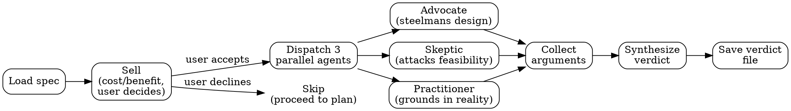

# Design Debate

## Overview

The debate sits between brainstorm and plan in the pipeline workflow. After a spec has been written and reviewed, but before implementation planning begins, three parallel agents stress-test the design from fundamentally different perspectives. The goal is to surface hidden assumptions, scope creep, feasibility gaps, and real-world mismatches that cause full plan rewrites downstream.

**Core principle:** Good designs survive adversarial challenge. Bad designs collapse under it. Find out which you have before spending tokens on a plan.

## The Process



## Agent Roles

All three agents use `models.review` (sonnet). Synthesis happens in the main context.

### Advocate
Steelmans the design. Identifies what the spec gets right, argues against simpler alternatives, defends the chosen scope and approach. Looks for strengths that should become hard constraints in the plan.

### Skeptic
Attacks feasibility, scope creep, token economics, maintenance burden, failure modes, and edge cases. Must propose a simpler alternative if one exists. The skeptic's job is to find the cheapest version of the design that still delivers value.

### Domain Practitioner
Grounds the debate in real-world usage patterns, existing tools that solve parts of the problem, ecosystem expectations, and what users actually need versus what sounds impressive. Provides practical scope recommendations based on how similar problems are solved in production systems.

## Verdict Format

The synthesis produces a structured verdict with these sections:

### Disposition
One of:
- **proceed** — all panelists broadly agree the design is sound
- **proceed-with-constraints** — design is viable but contested points must be resolved in the plan
- **rethink** — fundamental assumptions are invalidated; recommend re-running brainstorm with debate findings

### Points of Agreement
What all three panelists endorse. These become **hard constraints** for the plan — the plan must not violate them.

### Contested Points
Where panelists disagree, with each position stated. The plan author must make an explicit choice on each contested point and document the reasoning.

### Invalidated Assumptions
Things the spec assumed that do not hold, as identified by any panelist. Each must include evidence or reasoning.

### Risk Register
Failure modes the plan must mitigate. Each entry includes the risk, which panelist raised it, likelihood (HIGH/MEDIUM/LOW), and the mitigation the plan should include.

## Size-Based Sell Defaults

| Change Size | Default | Rationale |
|-------------|---------|-----------|
| TINY | Not offered | Debate adds no value for single-file changes |
| MEDIUM | Skip (y/N) | Most MEDIUM plans survive without debate |
| LARGE | Run (Y/n) | Complex specs have hidden assumptions that only adversarial challenge surfaces |
| MILESTONE | Run (Y/n) | Multi-system changes require debate to avoid expensive plan rewrites |

## Model Routing

| Role | Model | Rationale |
|------|-------|-----------|
| Advocate | `models.review` (sonnet) | Analytical argumentation, code-aware |
| Skeptic | `models.review` (sonnet) | Analytical argumentation, cost-aware |
| Practitioner | `models.review` (sonnet) | Analytical argumentation, domain-aware |
| Synthesis | Main context | Needs full conversation context to produce verdict |

## Red Flags / Rationalization Prevention

| Thought | Reality |
|---------|---------|
| "The spec already went through review" | Review checks internal consistency. Debate challenges external validity. |
| "This will slow us down" | A 60-second debate is cheaper than a full plan rewrite. |
| "The panelists will just agree" | If all three agree, you get a proceed disposition in 30 seconds. No cost. |
| "I already know the skeptic's objections" | If you do, they will confirm quickly. If you don't, you needed the debate. |
| "MEDIUM changes don't need this" | Correct — that is why MEDIUM defaults to skip. Respect the default. |
| "I'll just incorporate the feedback mentally" | Unwritten constraints are forgotten constraints. The verdict file exists so the plan reads it. |
| "The user is in a hurry" | Present the sell honestly. Let the user decide. Never skip the sell for LARGE+. |

## Issue Tracker Contract

Debate is a **Category 3 — Decision Command** per `skills/github-tracking/SKILL.md`.

When `integrations.github.enabled` and `integrations.github.issue_tracking` are both `true`:

1. Read `github_epic: N` from the spec metadata
2. After the verdict is produced, post a summary comment on the epic
3. Do NOT create child issues — the verdict is a comment, not a trackable item

**Comment format:**

```
## Debate

**Disposition:** [proceed / proceed-with-constraints / rethink]
**Points of agreement:** [N]
**Contested points:** [N]
**Risks registered:** [N]
[1-sentence verdict summary]

Verdict: `[path to verdict file]`
```

If the epic is not found, skip tracking silently.
If the debate was not run (user declined the sell or change size below threshold), there is no verdict to post — skip tracking.
