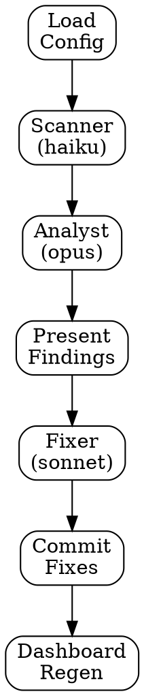

# Markdown Review

## Overview

The markdown review agent ensures Pipeline's instruction set stays focused, properly cross-referenced, and context-budget-aware. It reviews the plugin's own files (commands, skills, prompt templates, config) AND markdown generated by other agents (findings reports, session logs, decisions).

Two modes:

- **Full sweep** (`/pipeline:markdown-review`) — Scanner collects facts, Analyst applies all three tiers, Fixer applies batched fixes, dashboard regenerates.
- **Inline guidance** — The `inline-checklist.md` in this directory is a six-item checklist that generating agents reference before finalizing any markdown output.

## Core Principle

"Markdown is the codebase. If the instructions degrade, every agent degrades."

## Process Flow



## Three Tiers of Concern

### Tier 1 — File Hygiene (MR-HYG)

| Finding | Description |
|---------|-------------|
| Line count over limit | File exceeds configured limit (default 200 lines) |
| Mixed concerns | File blends process instructions with reference data |
| Frontmatter violations | Commands missing `allowed-tools`/`description`; skills missing `name`/`description` |
| Duplicate text blocks | More than 20 lines of identical content across two or more files |
| Dead cross-references | Linked file path does not exist on disk |

### Tier 2 — Information Architecture (MR-ARCH)

| Finding | Description |
|---------|-------------|
| Reference data inlined | Data better stored in postgres or a separate reference file is embedded in an instruction file |
| Context budget excess | File token estimate is disproportionate to its role in the context window |
| Embedding utilization gaps | Content that could be retrieved via the knowledge tier is loaded unconditionally |
| Storage trade-off messaging | Analyst notes migration options; it does not auto-migrate |

### Tier 3 — Agent Communication / A2A Protocol (MR-A2A)

| Finding | Description |
|---------|-------------|
| Missing DATA boundary tags | A `[PLACEHOLDER]` that receives external content has no `<DATA ...>` wrapper |
| Undocumented placeholders | Template has substitution points with no substitution checklist |
| Overloaded agent interfaces | Agent receives more substitution context than it uses |
| Output contract drift | A template's output format no longer matches what the consuming command parses |
| Config key drift | Config key referenced in a file but undocumented, or documented but not referenced |
| Handoff mismatches | Producer output fields do not match consumer expected input fields |

## Finding Format

```
MR-[TIER]-[NNN] | [SEVERITY] | [CONFIDENCE] | [file:line] | [category]
```

Example: `MR-A2A-001 | HIGH | HIGH | skills/building/builder-prompt.md:12 | missing-data-tag`

## Effort Classification

| Effort | Scope | Auto-fix |
|--------|-------|----------|
| quick | Single file, mechanical | Yes |
| medium | Multi-file, pattern changes | Yes |
| architectural | Structural redesign | Report only |

## Severity Mapping

| Severity | Examples |
|----------|----------|
| HIGH | Dead cross-refs, missing DATA tags, handoff mismatches, output contract drift |
| MEDIUM | Files >300 lines, duplicate blocks >20 lines, undocumented placeholders, overloaded interfaces |
| LOW | Files 200-300 lines, frontmatter inconsistencies, config key drift, postgres migration candidates, context budget warnings |

## Model Routing

| Agent | Model | Config Key | Role |
|-------|-------|------------|------|
| Scanner | haiku | `models.cheap` | Mechanical data collection |
| Analyst | opus | `models.architecture` | All 3 tiers, structured findings |
| Fixer | sonnet | `models.implement` | Apply fix instructions |

## Red Flags — Rationalization Prevention

| Rationalization | Reality |
|----------------|---------|
| "This file is fine at 250 lines" | Check if it mixes process and reference data |
| "The duplicate block is only 15 lines" | 15 lines x 14 files = 210 lines of duplicated context |
| "DATA tags aren't needed for config values" | CLAUDE.md says ALL placeholders wrapped, no exceptions |
| "The agent needs all that context" | Quantify what it reads vs. what it receives |
| "It works, so the interface is fine" | "Works" != well-structured. Quantify token cost |
| "Splitting will break the flow" | If it mixes concerns, it is already broken |

## Prompt Templates

When dispatching subagents, read and use these prompt template files (located in the same directory as this SKILL.md):

- `./scanner-prompt.md` — Mechanical data collection agent (haiku)
- `./analyst-prompt.md` — Tier 1/2/3 analysis agent (opus)
- `./fixer-prompt.md` — Apply fix instructions agent (sonnet)

**Before dispatching each agent:** Replace all `{{MODEL}}` and `[PLACEHOLDER]` values with actual data from config and the current review context.

**Placeholder syntax convention:**
- `{{DOUBLE_BRACES}}` — Model name for the Agent tool's `model:` parameter. Not inside prompt text.
- `[BRACKET_CAPS]` — Content substitution inside prompt text. Replaced with actual data.

## Key Principles

- **Config-driven** — all thresholds and model assignments from `pipeline.yml`
- **Read-then-fix** — Scanner collects, Analyst judges, Fixer applies; no skipping steps
- **Evidence-based** — every finding cites file and line, quantifies token cost where relevant
- **Effort-classified** — quick and medium effort auto-fixed; architectural findings are report-only
- **Storage-agnostic** — Analyst notes when content could move to postgres or external files; it does not auto-migrate
- **Inline-checklist for prevention** — `inline-checklist.md` is referenced by generating agents to prevent regressions before they happen
