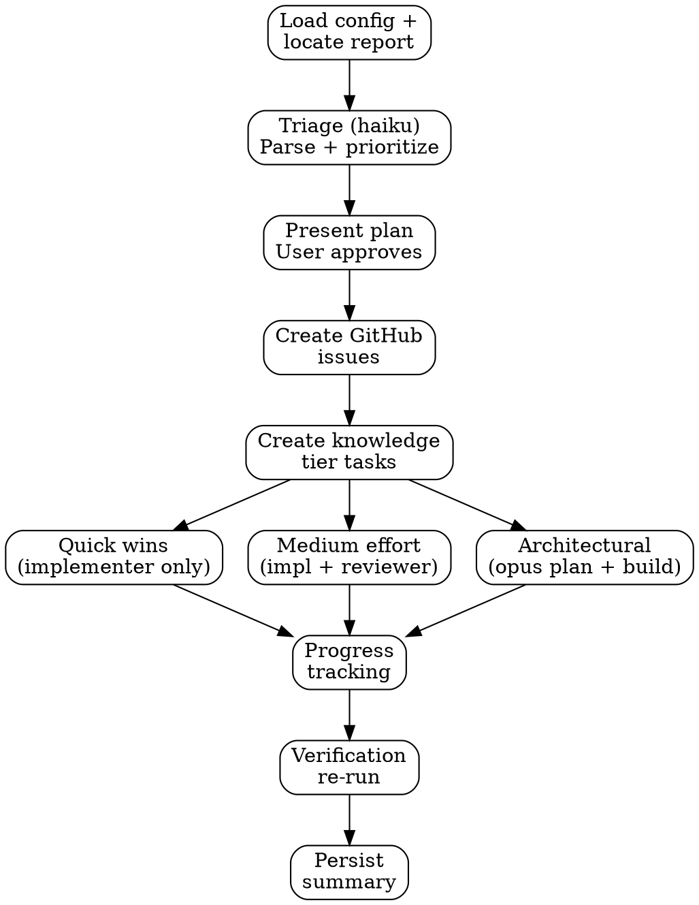

# Red Team Remediation

## Overview

Bridges the gap between security assessment and implementation. Takes a red team report, creates tracked issues, dispatches implementer/reviewer agents to fix findings, and verifies fixes with specialist re-runs.

**Core principle:** Every finding gets tracked. Every fix gets reviewed. Every fix gets verified.

## The Process

## Severity → Priority Mapping

| Report Severity | Remediation Priority | Action |
|----------------|---------------------|--------|
| CRITICAL | critical | Fix immediately. Implementer + reviewer. |
| HIGH | high | Fix in current batch. Implementer + reviewer. |
| MEDIUM | medium | Fix if confidence HIGH. Implementer + reviewer for medium effort; implementer only for quick wins. |
| LOW | low | Track only. No auto-fix. |
| INFO | low | Track only. No auto-fix. |

## Issue Creation Thresholds

The `remediate.auto_issue_threshold` config controls which findings get GitHub issues:

| Threshold | Creates Issues For |
|-----------|-------------------|
| `"all"` | Every finding regardless of severity |
| `"medium-high"` (default) | CRITICAL always, HIGH always, MEDIUM only if confidence HIGH |
| `"high"` | CRITICAL and HIGH only |

LOW and INFO findings are always tracked in the knowledge tier but never get auto-created issues.

## Batch Strategy

The `remediate.batch_strategy` config controls execution order:

| Strategy | Order | Best For |
|----------|-------|----------|
| `"effort"` (default) | Quick wins → Medium → Architectural | Maximize early progress, build confidence |
| `"severity"` | CRITICAL → HIGH → MEDIUM (within each: quick → medium → arch) | Address highest risk first |

## Effort Classification

Effort tiers come from the red team report's remediation roadmap:

| Tier | Description | Agent Strategy |
|------|-------------|---------------|
| Quick win (< 1 hour) | Single-file fix, clear remediation | Sonnet implementer only |
| Medium (1-4 hours) | Multi-file or pattern change | Sonnet implementer + sonnet reviewer |
| Architectural (> 4 hours) | Structural change, new abstractions | Opus planner → sonnet implementer + sonnet reviewer per step |

## Model Routing

| Phase | Model | Config Key | Rationale |
|-------|-------|-----------|-----------|
| Triage/parse | haiku | `models.cheap` | Mechanical extraction — no judgment |
| Quick win fix | sonnet | `models.implement` | Code writing with security context |
| Medium fix (implement) | sonnet | `models.implement` | Multi-file implementation |
| Medium fix (review) | sonnet | `models.review` | Adversarial review of security fix |
| Arch planning | opus | `models.architecture` | High-stakes structural decisions |
| Arch fix (implement) | sonnet | `models.implement` | Step-by-step implementation |
| Arch fix (review) | sonnet | `models.review` | Step-by-step review |
| Verification | sonnet | `models.review` | Specialist re-run for affected domains |

## Prompt Templates

When dispatching subagents, read and use these prompt template files (located in the same directory as this SKILL.md):
- `./triage-prompt.md` — Haiku triage/parser agent
- `./fix-planner-prompt.md` — Opus architectural fix planner

For implementer/reviewer agents, reuse the building skill templates:
- `skills/building/implementer-prompt.md` — Sonnet implementer
- `skills/building/reviewer-prompt.md` — Sonnet reviewer

**Placeholder syntax convention:**
- `{{DOUBLE_BRACES}}` — Model name for the Agent tool's `model:` parameter. Not inside prompt text.
- `[BRACKET_CAPS]` — Content substitution inside prompt text. Replaced with actual data (findings, config values, file contents).

## Integration Points

| System | How Remediation Uses It |
|--------|------------------------|
| Build workflow | Implementer + reviewer agent patterns, fresh-context-per-task |
| Red team specialists | Verification re-run uses same specialist prompts |
| Knowledge tier (Postgres) | Task creation with github_issue linking, decision recording |
| Knowledge tier (files) | Tracking table in docs/security/, gotchas append |
| GitHub CLI | Issue creation, issue closing with commit SHA |
| Commit preflight | Typecheck → lint → test after every fix |

## Red Flags — Rationalization Prevention

| Thought | Reality |
|---------|---------|
| "This finding is a false positive" | The lead analyst already filtered false positives. If you disagree, flag as INTENTIONAL with evidence — do not silently skip. |
| "The fix is obvious, no reviewer needed" | Medium and architectural fixes always get reviewed. Quick wins can skip review only because the fix scope is small. |
| "Let me fix multiple findings at once" | One commit per finding (or per step for architectural). Mixing fixes makes rollback impossible. |
| "The tests still pass, it's fine" | Passing tests don't prove a security fix is correct. The reviewer must verify the vulnerability is actually closed. |
| "This architectural change is too risky" | That's what the opus planner is for. It breaks the change into safe steps. |
| "I'll skip verification, the fixes are correct" | Verification catches regressions and incomplete fixes. Skip only if explicitly configured off. |
| "The preflight failed but the security fix is correct" | A fix that breaks the build is not a fix. Resolve the preflight failure first. |
| "This LOW finding should be fixed too" | Stick to the threshold. LOW/INFO findings are tracked, not auto-fixed. The user can override with threshold: "all". |

## Key Principles

- **Tracked** — every finding gets a knowledge tier task and optionally a GitHub issue
- **Batched** — fixes grouped by effort to maximize early progress
- **Reviewed** — medium and architectural fixes get adversarial review
- **Verified** — specialist re-runs confirm fixes actually close vulnerabilities
- **Atomic** — one commit per finding, rollback-friendly
- **Transparent** — progress reported between batches with commit SHAs
- **Config-driven** — thresholds, strategy, and verification from pipeline.yml
