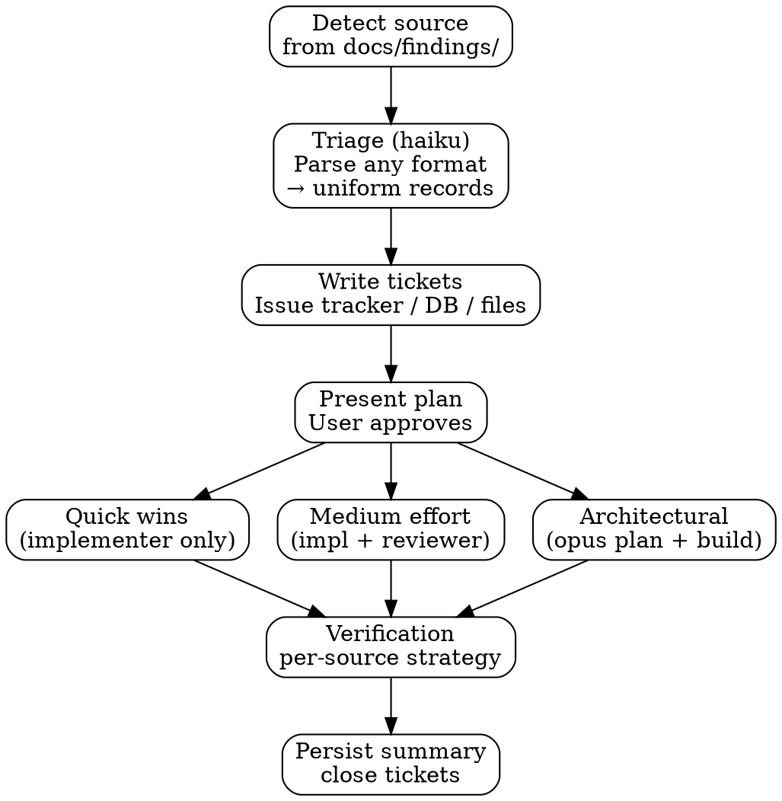

# Remediation

## Overview

Bridges the gap between finding discovery and implementation. Takes findings from any pipeline workflow (red team, audit, review, UI review, or external reports), creates tracked tickets, dispatches stateless implementer/reviewer agents, and verifies fixes.

**Core principle:** Every finding gets tracked. Every fix gets reviewed. Every fix gets verified.

## Uniform Artifact Model

All finding sources produce identical records. The `source` and `category` fields carry the type — nothing else changes.

| Field | Description | Examples |
|-------|-------------|----------|
| ID | Source-prefixed, unique | `RT-INJ-001`, `AUD-003`, `REV-012`, `UI-002`, `EXT-001` |
| SEVERITY | CRITICAL / HIGH / MEDIUM / LOW / INFO | Same scale for all sources |
| CONFIDENCE | HIGH / MEDIUM / LOW | Same scale for all sources |
| LOCATION | file:line or descriptive path | `src/auth.ts:42`, `screenshot:nav-bar` |
| CATEGORY | Domain-specific classifier | `security/CWE-89`, `dead-code`, `naming`, `ux/hit-target`, `custom` |
| DESCRIPTION | One-line summary | Same field for all sources |
| IMPACT | What happens if unfixed | Extracted per source type |
| REMEDIATION | Fix steps | Same field for all sources |
| EFFORT | quick / medium / architectural / none | Same tiers for all sources |
| VERIFICATION_DOMAIN | What to re-run | `INJ`, `sector-api`, `changed-files`, `screenshot`, `manual` |

**ID prefix mapping:** `RT-` (redteam), `AUD-` (audit), `REV-` (review), `UI-` (ui-review), `EXT-` (external)

## Ticket-Driven Context Store

Agents are stateless — they receive a ticket reference, read their own context, do work, write results back. The orchestrator carries only IDs and status, never finding text.

| Priority | Backend | When Available | Ticket Reference | How Agents Read |
|----------|---------|---------------|-----------------|----------------|
| 1 | **Issue Tracker** | `platform.issue_tracker` is not `none` | Issue/work-item ref (`42`) | `node '[SCRIPTS_DIR]/platform.js' issue view 42` |
| 2 | **Postgres** | `knowledge.tier == "postgres"` AND `integrations.postgres.enabled` (runs alongside issue tracker when both are available) | Finding ID (`RT-INJ-001`) | `node scripts/pipeline-db.js get finding RT-INJ-001` |
| 3 | **Files** | Always (fallback) | Finding ID in tracking file | Inline context in prompt (only fallback) |

**Critical rules:**
1. After triage, the raw report is never read again.
2. After ticket creation, triage output is never read again — tickets are the source of truth.
3. The orchestrator carries only: finding IDs, issue numbers, commit SHAs, and status.
4. Each agent dispatch is one message with references. One result back. Max 1 retry.

## The Process



## Severity → Priority Mapping

| Severity | Priority | Action |
|----------|----------|--------|
| CRITICAL | critical | Fix immediately. Implementer + reviewer. |
| HIGH | high | Fix in current batch. Implementer + reviewer. |
| MEDIUM | medium | Fix if confidence HIGH. Implementer + reviewer for medium effort; implementer only for quick wins. |
| LOW | low | Track only. No auto-fix. |
| INFO | low | Track only. No auto-fix. |

## Issue Creation Thresholds

The `remediate.auto_issue_threshold` config controls which findings get issues:

| Threshold | Creates Issues For |
|-----------|-------------------|
| `"all"` | Every finding regardless of severity |
| `"medium-high"` (default) | CRITICAL always, HIGH always, MEDIUM only if confidence HIGH |
| `"high"` | CRITICAL and HIGH only |

## Batch Strategy

| Strategy | Order | Best For |
|----------|-------|----------|
| `"effort"` (default) | Quick wins → Medium → Architectural | Maximize early progress |
| `"severity"` | CRITICAL → HIGH → MEDIUM | Address highest risk first |

## Effort Classification

| Tier | Description | Agent Strategy |
|------|-------------|---------------|
| Quick win | Single-file fix, clear remediation | Sonnet implementer only |
| Medium | Multi-file or pattern change | Sonnet implementer + sonnet reviewer |
| Architectural | Structural change, new abstractions | Opus planner → sonnet implementer + reviewer per step |

## Implementation / Verification Split

Remediation implements fixes ONLY. It does NOT dispatch verification.

The orchestrator routes to the appropriate verification step after fixes are committed:
- Red team findings → purple team verification
- Audit findings → audit sector re-run
- Review findings → review re-run
- UI findings → screenshot verification

This split ensures:
1. Each fix goes through build gates (lint + post-task review) before verification
2. The orchestrator controls the loopback — if verification fails, it routes back to remediation
3. Remediation agents are stateless — they fix one finding, commit, and report done

### Architecture Plan Compliance

If `docs/architecture.md` exists, the implementer agent reads it for:
- **Banned patterns** — the fix must not introduce a banned pattern
- **Module boundaries** — the fix must respect defined interfaces
- **Typed contracts** — the fix must match contract shapes

The implementer agent reads `docs/architecture.md` directly from the project root as part of its context-gathering step (v2 store-read pattern).

### Verification Strategies (reference — dispatched by orchestrator, not by remediation)

| Strategy | Source Default | Dispatch | Scope |
|----------|--------------|----------|-------|
| `specialist-rerun` | redteam | Specialist agents from `skills/redteam/specialist-agent-prompt.md` | Modified files, scoped to VERIFICATION_DOMAIN |
| `sector-rerun` | audit | Sector agents from `skills/auditing/sector-agent-prompt.md` | Modified files, scoped to sector |
| `review-rerun` | review | Review logic with `--since BASELINE_SHA` | Changed files |
| `screenshot` | ui-review | Chrome DevTools + haiku analysis | Full page |
| `none` | external | Skip | Print "Run the appropriate review command manually." |

## Model Routing

| Phase | Model | Config Key | Rationale |
|-------|-------|-----------|-----------|
| Triage/parse | haiku | `models.cheap` | Mechanical extraction |
| Quick win fix | sonnet | `models.implement` | Code writing |
| Medium fix (implement) | sonnet | `models.implement` | Multi-file implementation |
| Medium fix (review) | sonnet | `models.review` | Adversarial review |
| Arch planning | opus | `models.architecture` | High-stakes structural decisions |
| Verification | sonnet | `models.review` | Re-run for affected domains |

## Prompt Templates

When dispatching subagents, read and use these prompt template files (located in the same directory as this SKILL.md):
- `./triage-prompt.md` — Haiku triage/parser agent
- `./fix-planner-prompt.md` — Opus architectural fix planner

For implementer/reviewer agents, reuse the building skill templates:
- `skills/building/implementer-prompt.md` — Sonnet implementer
- `skills/building/reviewer-prompt.md` — Sonnet reviewer

**Placeholder syntax convention:**
- `{{DOUBLE_BRACES}}` — Model name for the Agent tool's `model:` parameter. Not inside prompt text.
- `[BRACKET_CAPS]` — Content substitution inside prompt text. Replaced with actual data.

## Uniform Outputs

**Commit format:** `fix: [ID] — [one-line description]`

The ID prefix carries the source type. No source-specific commit formatting.

**Issue body template (same for all sources):**
```markdown
## Finding

**ID:** [ID]
**Source:** [SOURCE_TYPE]
**Category:** [CATEGORY]
**Severity:** [SEVERITY]
**Confidence:** [CONFIDENCE]
**Location:** [LOCATION]

### Description
[description]

### Impact
[impact]

### Remediation
[remediation]

### Source Report
`[report path]`
```

Labels: `[source-type]`, `[severity-lowercase]`. Always two labels, same pattern.

## Reporting Contract

All three stores, every time. This is the A2A contract — the orchestrator and
verification agents read remediation results to understand what was fixed.

**Runtime placeholders** (resolved per finding during the fix cycle):
- `[FINDING_ID]` — from the triage artifact model (the finding being fixed, e.g., `RT-INJ-001`)
- `[FINDING_ISSUE]` — issue number created during the ticket step
- `[GITHUB_REPO]` — `integrations.github.repo` from pipeline.yml. Empty if issue tracking is disabled.
- `[SHA]` — commit SHA from the fix commit

### 1. Postgres Write

Update finding status in the knowledge DB after each fix:
```
PROJECT_ROOT=$(git rev-parse --show-toplevel) node "$PROJECT_ROOT/scripts/pipeline-db.js" insert knowledge \
  --category 'remediation' \
  --label 'fix-[FINDING_ID]' \
  --body "$(cat <<'BODY'
{"finding_id": "[FINDING_ID]", "status": "fixed|blocked", "commit_sha": "[SHA]", "effort": "quick|medium|architectural"}
BODY
)"
```

### 2. Issue Comment (if task issue is available)

Post fix status as a comment on the finding's issue:
```
cat <<'EOF' | node '[SCRIPTS_DIR]/platform.js' issue comment [FINDING_ISSUE] --stdin
## Fix Applied
**Finding:** [FINDING_ID]
**Commit:** [SHA]
**Effort:** [quick|medium|architectural]
**Build gates:** [lint PASS, review PASS | details if failed]

Awaiting verification by [verification strategy].
EOF
```

If the command fails, notify the user with the error and ask for guidance.

### 3. Build State

Update `build-state.json` with fix status for crash recovery.

### Fallback (issue tracking disabled)

If issue tracking is not enabled, skip the issue comment.
Postgres write, build state update, and commit are always required.

## Red Flags — Rationalization Prevention

| Thought | Reality |
|---------|---------|
| "This finding is a false positive" | The triage agent already parsed what was reported. If you disagree, flag as INTENTIONAL with evidence — do not silently skip. |
| "The fix is obvious, no reviewer needed" | Medium and architectural fixes always get reviewed. Quick wins can skip review only because the fix scope is small. |
| "Let me fix multiple findings at once" | One commit per finding. Mixing fixes makes rollback impossible. |
| "The tests still pass, it's fine" | Passing tests don't prove a fix is correct. The reviewer must verify the issue is actually closed. |
| "I'll skip verification, the fixes are correct" | Verification catches regressions and incomplete fixes. Skip only if explicitly configured off. |
| "The preflight failed but the fix is correct" | A fix that breaks the build is not a fix. Resolve the preflight failure first. |
| "This LOW finding should be fixed too" | Stick to the threshold. LOW/INFO findings are tracked, not auto-fixed. |
| "This source doesn't need remediation" | All finding sources feed the same pipeline. If findings exist, they need tracking. |
| "Security findings need a different issue format" | All sources use the same issue template. The category field carries the type. |
| "UI findings don't need issues" | Same threshold logic applies to all sources. The issue template is the same. |

## Key Principles

- **Uniform** — every source produces identical artifacts. Only `source` and `category` differ.
- **Ticket-driven** — agents read from tickets (issue tracker/DB), not pasted context. Low token overhead.
- **Stateless** — each agent receives a reference, reads its own context, writes results back.
- **Tracked** — every finding gets a DB record and optionally an issue
- **Batched** — fixes grouped by effort to maximize early progress
- **Reviewed** — medium and architectural fixes get adversarial review
- **Verified** — source-appropriate re-runs confirm fixes close issues
- **Atomic** — one commit per finding, rollback-friendly
- **Config-driven** — thresholds, strategy, and verification from pipeline.yml
