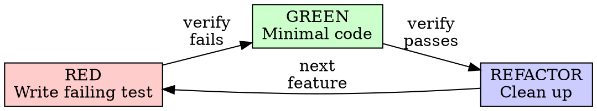

# Test-Driven Development (TDD)

## Overview

Write the test first. Watch it fail. Write minimal code to pass.

**Core principle:** If you didn't watch the test fail, you don't know if it tests the right thing.

## The Iron Law

```
NO PRODUCTION CODE WITHOUT A FAILING TEST FIRST
```

Write code before the test? Delete it. Start over. No exceptions.

## Red-Green-Refactor



### RED — Write Failing Test

Write one minimal test showing what should happen.

Requirements:
- One behavior per test
- Clear name describing behavior
- Real code (no mocks unless unavoidable)

### Verify RED — Watch It Fail

**MANDATORY. Never skip.**

Run the test command from pipeline.yml `commands.test`. Confirm:
- Test fails (not errors)
- Failure message is expected
- Fails because feature missing (not typos)

### GREEN — Minimal Code

Write simplest code to pass the test. Don't add features, refactor, or "improve" beyond the test.

### Verify GREEN — Watch It Pass

**MANDATORY.**

Confirm: test passes, other tests still pass, output pristine.

### REFACTOR — Clean Up

After green only: remove duplication, improve names, extract helpers.
Keep tests green. Don't add behavior.

## Common Rationalizations

| Excuse | Reality |
|--------|---------|
| "Too simple to test" | Simple code breaks. Test takes 30 seconds. |
| "I'll test after" | Tests passing immediately prove nothing. |
| "Need to explore first" | Fine. Throw away exploration, start with TDD. |
| "Test hard = design unclear" | Hard to test = hard to use. Simplify interface. |
| "TDD will slow me down" | TDD faster than debugging. |

## Red Flags — STOP and Start Over

- Code before test
- Test passes immediately
- Can't explain why test failed
- Rationalizing "just this once"

**All of these mean: Delete code. Start over with TDD.**

## Debugging Integration

Bug found? Write failing test reproducing it. Follow TDD cycle.
Test proves fix and prevents regression. Never fix bugs without a test.
